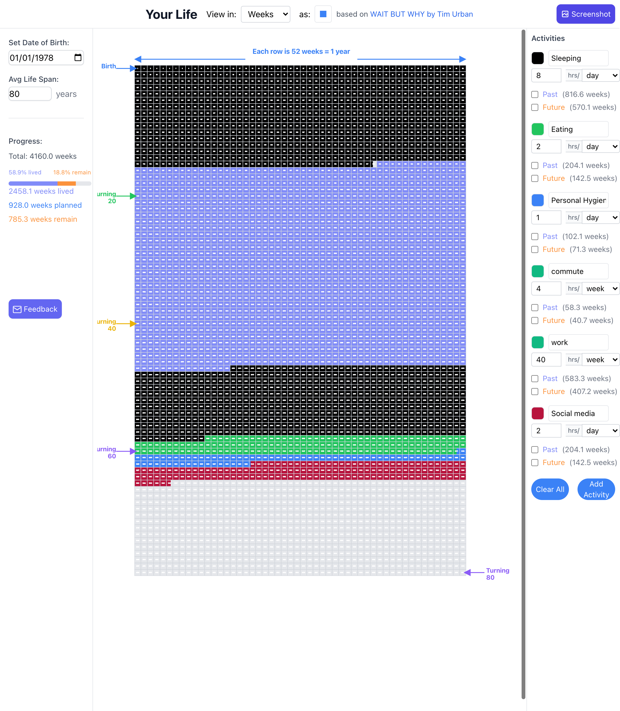

# Your Life

This application helps you visualize and plan your life's timeline effectively. It allows users to capture screenshots of their timeline and provides a simple feedback mechanism.

## Features
- Visualize and plan your life timeline.
- Capture screenshots of the timeline.
- Provide feedback via email.

## Getting Started
This project was bootstrapped with [Create React App](https://github.com/facebook/create-react-app).

In the project directory, you can run:

### `npm start`

Runs the app in the development mode.
Open [http://localhost:3000](http://localhost:3000) to view it in your browser.

### `npm test`

Launches the test runner in the interactive watch mode.

## Screenshot

## App Controls

- **Screenshot Button**: This button allows you to capture the current view of your timeline. It is located at the top right corner of the screen.
- **Feedback Button**: Located at the bottom left corner, this button opens your email client to send feedback about the app.
- **Shape Selector**: This control allows you to choose different shapes for visualizing your timeline. It is located near the top of the grid.

## Life Grid Visualization

The central Life Grid is an interactive visualization of your life timeline:

- **Time Unit Views**: Change how you view your life using the dropdown at the top
  - **Weeks**: Each cell represents one week (52 weeks = 1 year)
  - **Months**: Each cell represents one month (12 months = 1 year)
  - **Years**: Each cell represents one year of your life

- **Grid Navigation**:
  - **Birth**: Marked at the start of your timeline
  - **Current Age**: Shows your current position in life
  - **Turning Points**: Age markers help track significant years (20, 40, 60, 80)

- **Cell Shapes**: Customize the grid appearance using different shapes
  - **Squares**: Traditional grid layout (default)
  - **Circles**: Alternative visualization style
  - Change shapes using the shape selector at the top of the grid

- **Color Coding**:
  - **Black**: Past weeks/months/years
  - **Gray**: Future weeks/months/years
  - **Colored Cells**: Time periods with activities
  - Each activity gets its own unique color for easy tracking

- **Grid Layout**:
  - Reads left-to-right, top-to-bottom
  - Each row represents roughly one year of life
  - Hover over cells to see the corresponding date

## Settings Section

The Settings section allows you to customize your life timeline visualization:

- **Date of Birth (DOB)**: Enter your birth date to set the starting point of your timeline
- **Average Life Span**: Set your expected lifespan in years to determine the timeline's end point
- **Progress Tracking**: The app automatically calculates and displays:
  - Total weeks in your timeline
  - Weeks lived
  - Weeks planned
  - Weeks remaining

## Activities Section

The Activities section helps you track how you spend your time:

- **Add Activities**: Create new activities to track different aspects of your life
- **Time Units**: Choose between day, week, month, or year for each activity
- **Hours**: Set hours spent on each activity (max 24 hours/day or 80 hours/week)
- **Past & Future**: Mark activities as completed (Past) or planned (Future)
- **Color Coding**: Each activity gets a unique color for easy visualization
- **Clear All**: Option to reset all activities when needed

## Acknowledgments

The majority of the code for this application was developed using the Windsurf AI tool, which greatly assisted in streamlining the development process and enhancing productivity.

## Credits
This application is inspired by Tim Urban's work on [Wait But Why](https://waitbutwhy.com/2014/05/life-weeks.html).

## Feedback

For any feedback or inquiries, please reach out to [saidevac1129@gmail.com](mailto:saidevac1129@gmail.com).

Feel free to contribute and provide feedback!
